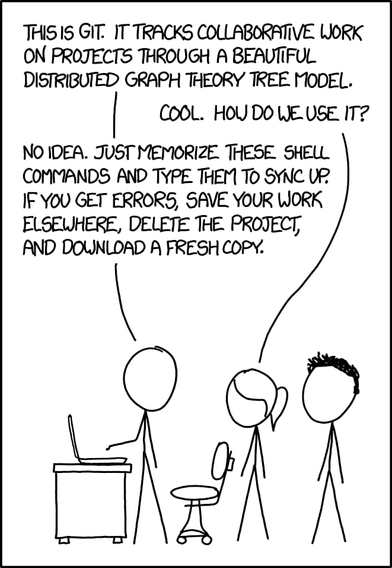
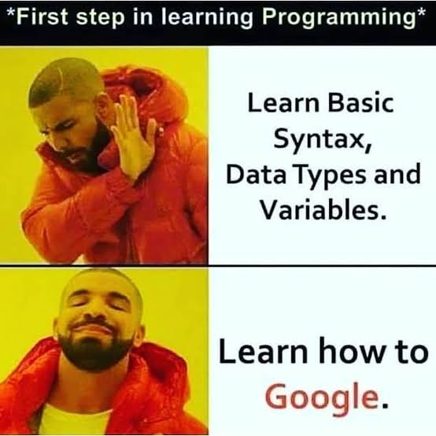
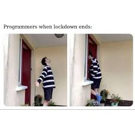
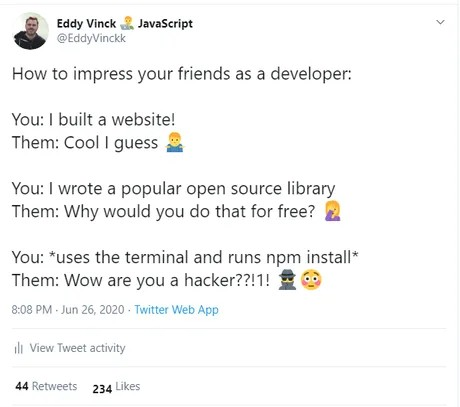

# DEV_WEEK brought to you by EEESoc

This is Dev Week, a time to invest your time and potential in expanding your skill set. Throughout this week you will be learning various things all by doing yourself, right from the scratch.

**Sounds interesting? Hop in.**

Lets divide this week into smaller tasks.

## Tasks
- [ ] Learn Git and GitHub by making an account on GitHub
    - [ ] Resources for Git and GitHub :
        - <a href="https://www.youtube.com/watch?v=HVsySz-h9r4">Git Tutorial for Beginners: Command-Line Fundamentals(Corey Schafer)</a>
        - <a href="https://www.youtube.com/watch?v=xuB1Id2Wxak">What is Git | What is GitHub | Git Tutorial | GitHub Tutorial | Devops Tutorial | Edureka</a>
        - <a href="https://learngitbranching.js.org/">Learn Git Branching</a>
        
        
        
- [ ] <a href="https://help.github.com/en/github/getting-started-with-github/fork-a-repo#fork-an-example-repository">Fork</a> the repo <a href="https://github.com/EEESocbitmesra/DEV_WEEK">EEESoc BIT Mesra's, DEV_WEEK</a>
- [ ] <a href="https://help.github.com/en/github/creating-cloning-and-archiving-repositories/cloning-a-repository">Clone</a> the forked repo
- [ ] Copy the folder **project_folder** to some other location on your computer
- [ ] Now go <a href="https://github.com/EEESocbitmesra/DEV_WEEK/tree/master/project_folder#day-1">here</a> and start __Day1__

## Rules and Tips
- :+1: While editing the template, follow the <a href="https://github.com/EEESocbitmesra/DEV_WEEK/blob/master/README.md">README.md</a> file. Points will be awarded accordingly.
- :+1: After completing all the tasks of a single day, make sure to update <a href="https://docs.google.com/spreadsheets/d/1SMP1g4yqpL8hpf8T1GFFPBTMSHZHmMZd8xaNTdwJbYE/edit?usp=sharing">this</a> sheet. 
- :+1: Follow [this](https://codinginflow.com/google-programming-questions) website if stuck and then move to next rule, if the issue still persists.

- :+1: Keep asking doubts, as they are a part of learning.
- :+1: Every Programming language has a coding standard, make sure to follow that. Why? 
  -  > To become a better Developer :wink:
  
  

## Note:
- You can contact all the mentors on this <a href="https://discord.gg/WbRdAqF">discord</a>. We are always ready to help you.
- Do not hesitate to ask any doubt, even if you think it is silly.
- We encourage you to take help from your friends too. There are channels in the discord for this. Make use of it.

- If you are stuck anywhere, remember, google is your best friend.

## Coordinators for the event
- <a href="https://github.com/devansh03">Devansh</a>
- <a href="https://github.com/vd-07">Vivek</a>
- <a href="https://github.com/singhsuryansh12">Suryansh</a>
- <a href="https://github.com/ashusketch382">Ashutosh</a>
- <a href="https://github.com/saujanya01">Saujanya</a>

## Submissions

- Ankur Singh => https://update-ankur.github.io/
- Saketh Kumar Pabba => https://sakpab2602.github.io/sakpab2602/
- Aprajita Kumari => https://aprajita479.github.io/
- Zeeshan Equbal => https://zee-bit.github.io/
- Ankit Kumar => https://ankitk26.github.io/
- Dipan Mukhopadhyay=>https://dipjsr16.github.io/